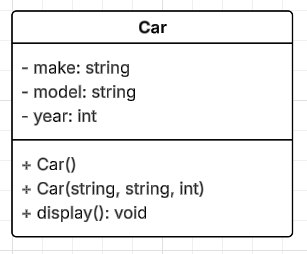

# tvt25kmo_cplus_luento_esimerkit

## Terminaaliongelma

Uusin Qt Creator sulkee ulkoisen terminaali-ikkunan automaattisesti. Mitkään asetukset eivät tunnu tähän auttavan.
Laitoin jokaisen sovelluksen loppuun alla olevan rivin tuon estämiseksi
<pre>
system("pause");
</pre>

## Ratkaisu

Tuo ongelma on Qt Creatorin versiossa 17.0.0, mutta se on korjattu ainakin versioon 18.0.0

## Lisätehtävä1 (1-3)

Kansiossa Lisatehtava_1 oleva sovellus sisältää ratkaisut tehtäviin 1-3, jotka ovat sivulla [https://peatutor.com/cplus/luento_esimerkit/extras.php](https://peatutor.com/cplus/luento_esimerkit/extras.php)



"Kuva 1: Car luokan luokkakaavio."

### Selitykset `getMake` ja `setMake` -funktioiden `const`-sanoille

#### `string getMake() const;`

- `const` funktion **lopussa** tarkoittaa, että tämä jäsenfunktio **ei muuta olion tilaa**.  
- Toisin sanoen funktio **ei saa muuttaa luokan jäseniä** (eli muuttujia kuten `make`, `model` tai `year`).  

---

#### `void setMake(const string &newMake);`

- Tässä `const` liittyy **parametriin** `newMake`.  
- Se tarkoittaa, että funktion sisällä **parametrin arvoa ei voi muuttaa**.  
- Koska parametri välitetään viitteenä (`&`) tehokkuuden vuoksi, `const` suojaa alkuperäistä arvoa muutoksilta.

**Esimerkki:**
```cpp
void Auto::setMake(const string &newMake) {
    // newMake = "Honda"; //  Ei sallittu, koska newMake on const
    make = newMake;       // Sallittu – arvo vain kopioidaan
}
```

---

#### Yhteenveto

| Funktio | `const`-sanan merkitys |
|----------|------------------------|
| `string getMake() const;` | Funktio ei muuta olion jäseniä. |
| `void setMake(const string &newMake);` | Parametria `newMake` ei voi muuttaa funktion sisällä. |

## Perintä

### perinta_esim1

Tehtävän tarkoitus on esittää, kuinka suojaustasot (private, protected, public) vaikuttavat perivän luokan toimintaan.

### perinta_esim2

Tehtävän tarkoitus on esittää seuraavat asiat:
- perinnän hyöty: kantaluokan ominaisuuksien hyödyntäminen useammassa aliluokassa
- kantaluokan konstruktorin hyödyntäminen aliluokassa
- polymorfismi eli "eri oliot voivat vastata samaan viestiin (eli metodikutsuun) omalla tavallaan" (tulostaTiedot()-metodi tässä)
- metodin ylikirjoittaminen (sanat virtual ja override)
- auto sanan hyödyntäminen vektorissa, jossa eri luokkien olioita