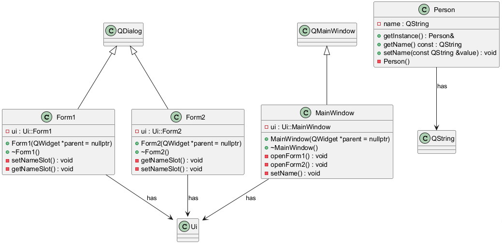

# tvt25kmo_cplus_luento_esimerkit

## Terminaaliongelma

Uusin Qt Creator sulkee ulkoisen terminaali-ikkunan automaattisesti. Mitkään asetukset eivät tunnu tähän auttavan.
Laitoin jokaisen sovelluksen loppuun alla olevan rivin tuon estämiseksi
````
system("pause");
````

## Ratkaisu

Tuo ongelma on Qt Creatorin versiossa 17.0.0, mutta se on korjattu ainakin versioon 18.0.0

## Lisätehtävä1 (1-3)

Kansiossa Lisatehtava_1 oleva sovellus sisältää ratkaisut tehtäviin 1-3, jotka ovat sivulla [https://peatutor.com/cplus/luento_esimerkit/extras.php](https://peatutor.com/cplus/luento_esimerkit/extras.php)


"Kuva 1: Car luokan luokkakaavio."

### Selitykset `getMake` ja `setMake` -funktioiden `const`-sanoille

#### `string getMake() const;`

- `const` funktion **lopussa** tarkoittaa, että tämä jäsenfunktio **ei muuta olion tilaa**.  
- Toisin sanoen funktio **ei saa muuttaa luokan jäseniä** (eli muuttujia kuten `make`, `model` tai `year`).  

---

#### `void setMake(const string &newMake);`

- Tässä `const` liittyy **parametriin** `newMake`.  
- Se tarkoittaa, että funktion sisällä **parametrin arvoa ei voi muuttaa**.  
- Koska parametri välitetään viitteenä (`&`) tehokkuuden vuoksi, `const` suojaa alkuperäistä arvoa muutoksilta.

**Esimerkki:**
```cpp
void Auto::setMake(const string &newMake) {
    // newMake = "Honda"; //  Ei sallittu, koska newMake on const
    make = newMake;       // Sallittu – arvo vain kopioidaan
}
```

---

#### Yhteenveto

| Funktio | `const`-sanan merkitys |
|----------|------------------------|
| `string getMake() const;` | Funktio ei muuta olion jäseniä. |
| `void setMake(const string &newMake);` | Parametria `newMake` ei voi muuttaa funktion sisällä. |

## Perintä

### perinta_esim1

Tehtävän tarkoitus on esittää, kuinka suojaustasot (private, protected, public) vaikuttavat perivän luokan toimintaan.

### perinta_esim2

Tehtävän tarkoitus on esittää seuraavat asiat:
- perinnän hyöty: kantaluokan ominaisuuksien hyödyntäminen useammassa aliluokassa
- kantaluokan konstruktorin hyödyntäminen aliluokassa
- polymorfismi eli "eri oliot voivat vastata samaan viestiin (eli metodikutsuun) omalla tavallaan" (tulostaTiedot()-metodi tässä)
- metodin ylikirjoittaminen (sanat virtual ja override)
- auto sanan hyödyntäminen vektorissa, jossa eri luokkien olioita
- object slicing

## Muistivuoto

Tehtävässä muistivuoto on tahallaan aiheutettu muistivuoto, jota tutkitaan **Heob**-työkalun avulla.

## Qt Console sovellus

Tutustutaan Qt Frameworkin ominaisuuksiin kuten QObject-luokka ja Q_OBJECT-makro ja signal-slot systeemi.
Rakennetaan sovellus, joka hakee HTTP-protollan avulla dataa valmiista API:sta https://peatutor.com/json_example/index.php

Tuo API palauttaa dataa JSON-muodossa eli tällaisen JSON arrayn:
````
[
    {
    id: 1,
    firstname: "Matti",
    lastname: "Meikäläinen"
    },
    {
    id: 2,
    firstname: "Maija",
    lastname: "Virtanen"
    },
    {
    id: 3,
    firstname: "Pekka",
    lastname: "Pouta"
    },
    {
    id: 4,
    firstname: "Liisa",
    lastname: "Laine"
    }
]
````
Ja, kun halutaan yksittäinen JSON objekti se saadaan kirjoittamalla edellisen urlin perään indeksi eli esim. https://peatutor.com/json_example/index.php/1

Saadaan seuraava JSON objekti 
````
{
id: 1,
firstname: "Matti",
lastname: "Meikäläinen"
}
````

Käytetään lähteenä sivua https://peatutor.com/qt/

### Signal-Slot

On Qt Frameworkkiin sisältyvä systeemi, jolla voidaan korvata **callback**-funktioiden käyttö. Tässä sitä tarvitaan, koska http-request toimii asynkronisesti. Se tarkoittaa, että kun lähetämme http-requestin, niin sovellus "ei pysähdy odottamaan vastausta". Eli tuon kutsun perään emme voi kirjoittaa koodia, joka tulostaa saamamme vastauksen.

Signal-slot toimii edellä siten, että kun palvemimelta on saatu vastaus http-requestiin, niin tuo request metodi "nostaa" signaalin nimeltään **finished**. Kytkemme tuon signaalin kirjoittamaamme slottiin. Tuo slot on ihan normaali metodi. Ja tuossa slotissa tulostamme saamamme vastauksen eli http-responsen lähettämän datan. Ja siis kun tuo signaali nousee, niin tuo slot metodi suoritetaan.

### Qt:n event loop

Kun luodaan Qt konsolisovellus, sen main.cpp on seuraavanlainen:
````
#include <QCoreApplication>

int main(int argc, char *argv[])
{
    QCoreApplication a(argc, argv);
    return a.exec();
}
````

Lause a.exec(); käynnistää tapahtumasilmukan (event loop), joka
  - Käsittelee Qt-tapahtumia (signaalit, ajastimet, verkkoliikenne, jne.)
  - Estää ohjelman suorituksen jatkumisen - funktio ei palaa ennen kuin a.quit() tai a.exit() kutsutaan
  - Palauttaa poistumiskoodin (exit code) kun ohjelma suljetaan

  Ilman a.exec() kutsua, ohjelma suorittaisi main()-funktion loppuun asti ja päättyisi välittömästi.
  Tapahtumasilmukka pitää ohjelman käynnissä ja mahdollistaa asynkronisten operaatioiden (kuten signaalien ja
  slottien) toiminnan.

### finished signaali

Huomasin, että tuo finished signaali löytyy sekä manager, että reply luokasta. Tuo reply:n käyttö on hieman yksinkertaisempi, joten päivitin web-sivuni ohjeen sen mukaiseksi.

Tässä esimerkissä connect funktion määritys oli:
````
connect(manager, &QNetworkAccessManager::finished, this,&HttpPerson::onePersonDataSlot);
````
Tällöin tuon onePersonDataSlot():n on saatava argumenttina reply, joten tuo slot oli määritelty näin:
````
onePersonDataSlot(QNetworkReply *reply)
````
Huomaa, että connect funktiossa ei tuota argumenttia tarvitse kirjoittaa tuohon slot-metodiin, vaan se menee siihen automaattisesti.

Jos connect funktiossa käytetäänkin replyn finished signaalia seuraavasti 
````
    reply = manager->get(request);
    connect(reply, &QNetworkReply::finished, this, &MainWindow::showResponse);
````
Nyt slotissa ei tarvita tuota parametria eli slot voidaan määritellä näin:
````
onePersonDataSlot()
````

## QtWidgetEsim1

### Tiedon välitys ikkunasta(Widgetistä) toiseen

Mainwindow:sta voidaan välittää annettu nimi Page2:een, siten että ennen Page2:n avaamista, kutsutaan Page:n setFname()-metodia.

Toiseen suuntaan välittäminen tapahtuu, niin että ennen Page2:n avaamista MainWindow:ssa kytketään Page2:n nameSetted-signaali slottiin showNameFromPage2(), joka hakee Page2:ssa asetetun nimen metodilla getFname(). Kun Page2:ssa nimi asetaan, niin siellä emitoidaan signaali nameSetted.

### Ui:n muotoilus qss-tiedoston avulla

Tiedostossa style.qss on asetettu painikkeille ja labeleille tyylit. Lisäksi on luotu tiedosto resource.qrc, jonka sisältö on:
````
<RCC>
    <qresource prefix="/">
        <file>style.qss</file>;
    </qresource>
</RCC>
````
Tuon tieodoston voi luoda tekstieditorilla tai Qt:n resurssieditorilla.

Lisäksi CMakeLists tiedostoon on lisätty rivit:
````
qt_add_resources(RESOURCES_ADDED resource.qrc)
target_sources(QtWidgetEsim1 PRIVATE ${RESOURCES_ADDED})
````

Ja main.cpp tiedostoon rivit:
````
QFile file(":/style.qss");
if (file.open(QFile::ReadOnly | QFile::Text)) {
    a.setStyleSheet(file.readAll());
}
````

## Widget_Esim2 ja Widget_Esim2_v2

Molemmissa esimerkeissä on Person luokka luotu Singleton-luokkana.

**Widget_Esim2**:ssa on hyvä huomata kuinka luodaan raakapointterilla olio, johon päästään käsiksi luokan jokaisesta metodista ja kuinka varmistetaan, että tuollainen olio tuhotaan. Tämä saadaan aikaan näin:
- Olio esitellään h-tiedoston private osassa
- Olio luodaan konstruktorissa
- Olio tuhotaan destruktorissa

**Widget_Esim2_v2**:ssa on tähän tilanteeseen paremmin sopiva Singleton malli, jossa Person oliot luodaan pinoon. Nyt tuon olion tuhoamisesta ei tarvitse huolehtia. Ja tällaiset pienet oliot suositellaan luotavaksi pinoon. Kun tätä sovellusta suoritetaan, niin voi olla ettei koskaan edes luoda tuota oliota. Voihan olla niin, että käyttäjä ei painelisi niitä painikkeita, joissa tuo olio luodaan.

### Sovelluksen UML kaavio


